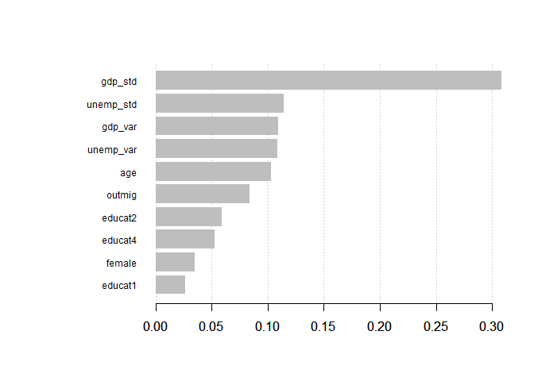
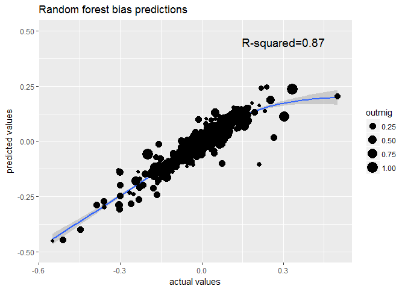
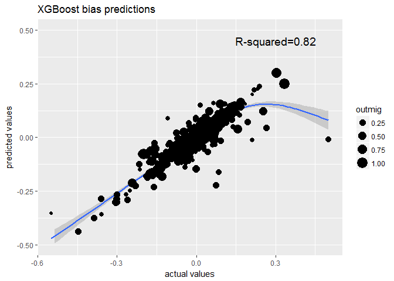
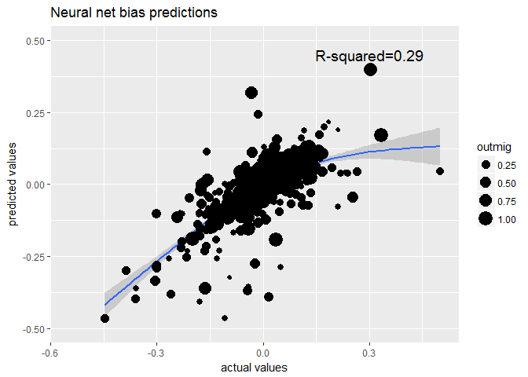
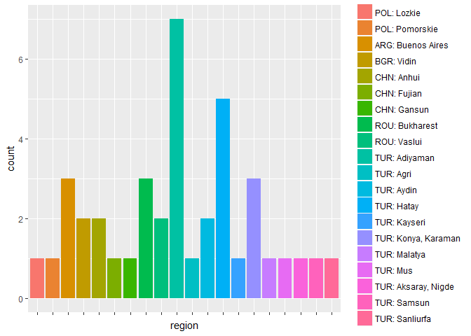
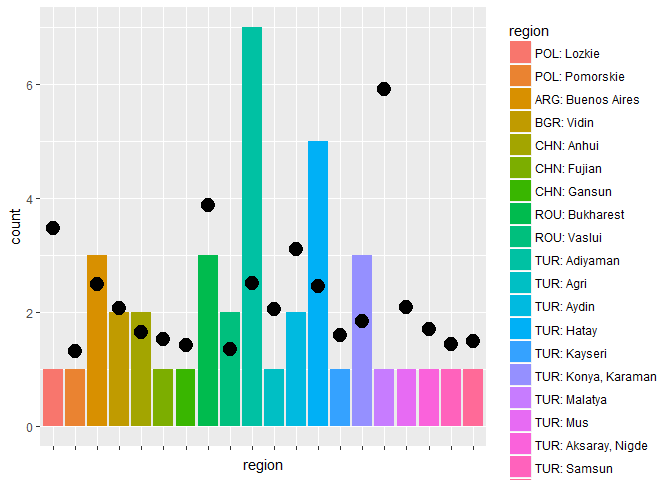

-   [Introduction](#introduction)
-   [Pre-processing data](#pre-processing-data)
    -   [Measuring educational selectivity](#measuring-educational-selectivity)
    -   [Additional measures](#additional-measures)
    -   [Tidying data](#tidying-data)
-   [Working with ML-tools](#working-with-ml-tools)
    -   [Loading pre-trained models](#loading-pre-trained-models)
    -   [Model summarys](#model-summarys)
    -   [Making predictions](#making-predictions)
    -   [Plotting performance](#plotting-performance)
-   [Identifying biased cases](#identifying-biased-cases)

Introduction
============

This tutorial describes the usage of pre-trained machine learning (ML) tools to predict the bias in measuring educational selectivity on the country-level as opposed to the regional level. In short, measurement error can substantially bias measures of educational selectivity in case outmigration is highly concentrated in some regions and when these regions are atypical in terms of their levels of unemployment and economic development. More details can be found in the article "Why we should care about regional origins: Educational selectivity among recent refugees and labor migrants in Western Europe." by Christoph Spörlein and Cornelia Kristen, published in Frontiers (2018).

Pre-processing data
===================

In order to use the pre-trained machine learning tools to predict the expected bias in new research projects, the data needs to conform to the input we used to train the models.

Measuring educational selectivity
---------------------------------

In short, educational selectivity is measured by recording individuals position in the age- and sex-specific educational distributions in their region (and/or country) of origin (i.e., what is typically refered to as relative education). Formally, relative education is defined as

$$\\sum\_{i=1}^I (\\frac{a\_{i-1}}{N} +\\frac{a\_{i}}{2\*N})$$

where i refers to the educational categories, *a*<sub>*i* − 1</sub> to the number of individuals one educational category lower \[this term is ignored for i=1, i.e., the lowest educational category\], *a*<sub>*i*</sub> to the number of individuals in the *i*<sup>*t**h*</sup> educational category and N to the total number of respondents in the same region, age and gender group as the respondent. The resulting values range from 0 to 1 where, for example, 0.6 would suggest that 60 percent of the regions's population with the same age and sex have an educational attainment that is at most as high as the individual considered.

Hence, every individual from the same region, the same age group, the same sex and the same educational attainment has the same value of relativ education. This makes things somewhat easier as we only need one observation for each of the different combinations of characteristics.

Additional measures
-------------------

In addition, the paper discusses a number of region- and country-level indicators that researchers need to collect before being able to make full use of the tools. The following table provides a short summary of all variables required:

------------------------------------------------------------------------

<table style="width:89%;">
<colgroup>
<col width="13%" />
<col width="52%" />
<col width="9%" />
<col width="12%" />
</colgroup>
<thead>
<tr class="header">
<th>Indicator</th>
<th>Description</th>
<th>Measurement level</th>
<th>Naming convention</th>
</tr>
</thead>
<tbody>
<tr class="odd">
<td>Age</td>
<td>Measured in five year intervals covering individuals age 15 to 64</td>
<td>Individual</td>
<td><em>age</em></td>
</tr>
<tr class="even">
<td>Sex</td>
<td>0=male, 1=female</td>
<td>Individual</td>
<td><em>female</em></td>
</tr>
<tr class="odd">
<td>Education</td>
<td>Measured using four dummy varaibles: primary completed [ISCED0,1], some secondary [ISCED2], secondary completed [ISCED3,4], tertiary completed [ISCED5,6]</td>
<td>Individual</td>
<td><em>educat1</em>-<em>educat4</em></td>
</tr>
<tr class="even">
<td>Region</td>
<td>ID variable for a country's regions</td>
<td>Regional</td>
<td><em>region</em></td>
</tr>
<tr class="odd">
<td>GDP</td>
<td>A region's gross domestic product; within-country standardized using population weights</td>
<td>Regional</td>
<td><em>gdp_std</em></td>
</tr>
<tr class="even">
<td>Unemp</td>
<td>A region's unemployment rate; within-country standardized using population weights</td>
<td>Regional</td>
<td><em>unemp_std</em></td>
</tr>
<tr class="odd">
<td>Outmig</td>
<td>A region's outmigration rate, measured using the ratios of relative regional outmigration and relative regional population. Values above 1 indicate higher outmigration than expected assuming outmigration that is proportional to a region's size. Relative regional outmigration is measures easiest using destination country data (<span class="math inline">$\frac{m_{ij}}{M_i}$</span> where <span class="math inline"><em>m</em><sub><em>i</em><em>j</em></sub></span> denotes emigrants from origin country i and its region j and <span class="math inline"><em>M</em><sub><em>i</em></sub></span> refers to the total number of emigrants from country i).</td>
<td>Regional</td>
<td><em>outmig</em></td>
</tr>
<tr class="even">
<td>GDP_VC</td>
<td>Coefficient of variation in regional GDP; population weighted</td>
<td>Country</td>
<td><em>gdp_var</em></td>
</tr>
<tr class="odd">
<td>Unemp_VC</td>
<td>Coefficient of variation in regional unemployment rates; population weighted</td>
<td>Country</td>
<td><em>unemp_var</em></td>
</tr>
</tbody>
</table>

All continous variables enter the analyses normalized.

Tidying data
------------

In order to illustrate wrangling the data into the required format, we will assume a typical scenario in quantitative sociological research: researchers are working with an individual level dataset that includes all variables listed in the above table and that is saved in Stata's .dta format. From hereon, we will rely heavily on packages from the "tidyverse" (see the excellent introductory book by [Grolemund and Hadley](http://r4ds.had.co.nz/)).

``` r
library(tidyverse)
```

Loading the dataset using the haven-package:

``` r
data <- haven::read_dta("selectivity_individual.dta") 
```

So, we need to change a couple of things before we can work with this data: dichotomize education, rename variables and finally aggregate the whole dataset to have one row represent one region. Let's first generate the dummy variables and rename variables:

``` r
data_clean <- data %>% 
  mutate(educat1=ifelse(isced==1,1,0),
         educat2=ifelse(isced==2,1,0),
         educat4=ifelse(isced==4,1,0)) %>%
  rename(female=sex,
         gdp_std=GDP,
         gdp_var=VC_GDP,
         unemp_std=UNEMP,
         unemp_var=VC_UNEMP)
```

Note that we did not define educat3 since this will be our reference category. Now, we simply aggregate each row by first grouping the data by each combination of region, age, sex and education and then replacing multiple values by their mean. Again, since every individual from the same region, the same age group, the same sex and the same educational attainment has the same value for each variable of interest (e.g., bias4c or the regional- and country-level measures), using the mean will leave their values unchanged.

``` r
data_clean <- data_clean %>% 
  group_by(region, age, female, isced) %>%
  summarise_all(funs(mean)) %>%
  arrange(region, female, age, isced)

nrow(data_clean)
```

    ## [1] 1740

``` r
head(data_clean)
```

    ## # A tibble: 6 x 13
    ## # Groups:   region, age, female [3]
    ##   region   age female isced   bias4c gdp_std gdp_var unemp_std unemp_var
    ##    <dbl> <dbl>  <dbl> <dbl>    <dbl>   <dbl>   <dbl>     <dbl>     <dbl>
    ## 1      1     1      0     2 -0.0244    0.437   0.275    -0.521     0.220
    ## 2      1     1      0     3  0.0130    0.437   0.275    -0.521     0.220
    ## 3      1     2      0     3  0.194     0.437   0.275    -0.521     0.220
    ## 4      1     2      0     4 -0.00432   0.437   0.275    -0.521     0.220
    ## 5      1     3      0     3  0.0671    0.437   0.275    -0.521     0.220
    ## 6      1     3      0     4  0.0794    0.437   0.275    -0.521     0.220
    ## # ... with 4 more variables: outmig <dbl>, educat1 <dbl>, educat2 <dbl>,
    ## #   educat4 <dbl>

Working with ML-tools
=====================

Loading pre-trained models
--------------------------

Now we can load the pre-trained machine learning models and use them to make predictions using our new data. Note that the corresponding files can be downloaded from the this github page. First, we need to load the packages used to estimate each model in order to gain access to model-specific prediction routines.

``` r
library(randomForest)
library(xgboost)
library(neuralnet)

load("rf.RData")
load("xgb.RData")
load("nn.RData")
```

Model summarys
--------------

We can get some short model summaries for the two tree-based methods:

``` r
# Random forest
rf
```

    ## 
    ## Call:
    ##  randomForest(formula = f, data = traindat, mtry = 7) 
    ##                Type of random forest: regression
    ##                      Number of trees: 500
    ## No. of variables tried at each split: 7
    ## 
    ##           Mean of squared residuals: 0.001557234
    ##                     % Var explained: 71.85

``` r
# XGBoost
xgb
```

    ## ##### xgb.Booster
    ## Handle is invalid! Suggest using xgb.Booster.complete
    ## raw: 1 Mb 
    ## call:
    ##   xgb.train(params = params, data = dtrain, nrounds = nrounds, 
    ##     watchlist = watchlist, verbose = verbose, print_every_n = print_every_n, 
    ##     early_stopping_rounds = early_stopping_rounds, maximize = maximize, 
    ##     save_period = save_period, save_name = save_name, xgb_model = xgb_model, 
    ##     callbacks = callbacks, seed = 1)
    ## params (as set within xgb.train):
    ##   seed = "1", silent = "1"
    ## callbacks:
    ##   cb.print.evaluation(period = print_every_n)
    ##   cb.evaluation.log()
    ## # of features: 10 
    ## niter: 1000
    ## nfeatures : 10 
    ## evaluation_log:
    ##     iter train_rmse
    ##        1   0.360306
    ##        2   0.255749
    ## ---                
    ##      999   0.008745
    ##     1000   0.008745

However, the output isn't too informative. XGBoost also provides a neat plotting function to show the relative importance of our predictors:

``` r
# plot feature importance
imp_mat <- xgb.importance (feature_names = xgb$feature_names ,model = xgb)
xgb.plot.importance (importance_matrix = imp_mat)
```



Apparently, a region's GDP is highly predictive of the extent of measurement bias.

Making predictions
------------------

Let's predict the bias for our new data:

``` r
# Random forest predictions
pred_rf <- predict(rf, newdata=data_clean)
RMSE_rf <- sqrt(mean((data_clean$bias4c-pred_rf)^2))
MAE_rf <- mean(abs(data_clean$bias4c-pred_rf))

# XGBoost predictions
# requires additional data setup
data_clean_xgb <- data_clean %>% 
  ungroup %>% 
  select(female,age,gdp_std,gdp_var,unemp_std,unemp_var,outmig,educat1,educat2,educat4) 
data_clean_xgb <- as.matrix(data_clean_xgb)
pred_xgb <- predict(xgb, newdata=data_clean_xgb)
RMSE_xgb <- sqrt(mean((data_clean$bias4c-pred_xgb)^2))
MAE_xgb <- mean(abs(data_clean$bias4c-pred_xgb))

# neural net predictions
# requires additional data setup
data_clean_nn <- data_clean %>% 
  ungroup %>% 
  select(female,age,gdp_std,gdp_var,unemp_std,unemp_var,outmig,educat1,educat2,educat4) 
pred_nn <- neuralnet::compute(nn,data_clean_nn)
RMSE_nn <- sqrt(mean((data_clean$bias4c-pred_nn$net.result)^2))
MAE_nn <- mean(abs(data_clean$bias4c-pred_nn$net.result))
```

Let's look at the prediction quality for each method:

| Model         | RMSE      | MSE       |
|---------------|-----------|-----------|
| Random forest | 0.027251  | 0.0141954 |
| XGBoost       | 0.0313561 | 0.0145148 |
| Neural net    | 0.0816913 | 0.0351103 |

Just as reported in the actual paper, both tree-based methods outperform the neural net.

Plotting performance
--------------------

We can also visually inspect the predictions by plotting them against the actual values. Note that points are weighted by the outmigration rate to give more "important" regions more weight. Each Figure also reports the associated *R*<sup>2</sup> to provide additional information regarding prediction quality.

``` r
# Plotting random forest results
dat <- as.data.frame(cbind(pred_rf, data_clean$bias4c, data_clean$outmig))
colnames(dat) <- c("y","x","outmig")
r <- round(summary(lm(y~x,dat))$r.squared, digits=2)
ggplot(dat, aes(x=x, y=y)) + 
  geom_point() + 
  geom_smooth() + 
  ylim(-0.5,0.5) + 
  labs(title="Random forest bias predictions", y="predicted values", x="actual values") + 
  annotate("text", label = paste0("R-squared=",r), x = 0.3, y = 0.45, size=5) + 
  geom_jitter(aes(size=outmig))
```



``` r
# Plotting XGBoost results
dat <- as.data.frame(cbind(pred_xgb, data_clean$bias4c, data_clean$outmig))
colnames(dat) <- c("y","x","outmig")
r <- round(summary(lm(y~x,dat))$r.squared, digits=2)
ggplot(dat, aes(x=x, y=y)) + 
  geom_point() + 
  geom_smooth() + 
  ylim(-0.5,0.5) + 
  labs(title="XGBoost bias predictions", y="predicted values", x="actual values") +
  annotate("text", label = paste0("R-squared=",r), x = 0.3, y = 0.45, size=5) + 
  geom_jitter(aes(size=outmig))
```



``` r
# Plotting neural net results
dat <- as.data.frame(cbind(pred_nn$net.result,data_clean$bias4c, data_clean$outmig))
colnames(dat) <- c("y","x","outmig")
r <- round(summary(lm(y~x,dat))$r.squared, digits=2)
ggplot(dat, aes(x=x, y=y)) + 
  geom_point()  + 
  geom_smooth() + 
  ylim(-0.5,0.5) + 
  labs(title="Neural net bias predictions", y="predicted values", x="actual values")+
  annotate("text", label = paste0("R-squared=",r), x = 0.3, y = 0.45, size=5) + 
  geom_jitter(aes(size=outmig))
```



Unsurprisingly, the figures neatly visualize the better performance of the tree-based methods yet again.

Identifying biased cases
========================

For simplicities sake, we will use the random forest predictions to identify those regions and countries where researchers can expect large bias based on the predictions. In an actual application, it might however be sensible to validate findings using the other prediction methods as well. For now, we will define "large" bias as exceeding absolute values of 0.15.

First, we need to merge the predictions back to the original dataset

``` r
prediction_data <- cbind(data_clean,pred_rf)
```

and extract all cases exceeding our predefined threshold:

``` r
threshold <- 0.15
problem_data <- prediction_data %>%
  filter(abs(pred_rf)>threshold)
nrow(problem_data)
```

    ## [1] 40

So, 40 cases are problematic under this definition. Since each row represents a cross-classification of region, sex, age and education, regions can show up in this part of the analyses multiple times.

Let's plot the findings to identify patterns:

``` r
ggplot(problem_data) + 
  geom_bar(aes(region, fill=region)) + 
  theme(axis.text.x = element_blank())
```



Considering that the data includes 305 regions from 22 origin countries, the first plot shows on usual clustering of only a handful of origin countries: Poland, Argentinia, Bulgaria, China, Romania and Turkey.

Note that these numbers may be somewhat misleading for a host of difference reasons: for one, every region is counted as a single case. Hence, while Argentinia is "only" represented with one region, it happens to be the region sending most migrants in our data (~30 percent). Similarily, Turkey is strongly represented among the outliers with 11 regions but mostly with regions which send comparatively few emigrants (alltogther 26 percent). One way to take this into account is to add information regarding (non-normalized) outmigration rates to the figure:

``` r
n_data <- problem_data %>% group_by(region) %>% count() %>% ungroup() 
problem_data <- problem_data %>% left_join(n_data, by="region") %>% mutate(newcount=n*outmig)
ggplot(problem_data) + 
  geom_bar(aes(region, fill=region)) + 
  geom_point(aes(y=outmig, x=region, size=4)) + 
  theme(axis.text.x = element_blank())
```



First of all, all regions depicted have outmigration ratios greater 1 suggesting that all of them have higher outmigration rates than expected giving their actual population size. More specifically, a value of 6 (see the Turkish region of Malatya) send 6 times more migrants than expected given its population. From a substantive standpoint then, all cases identified appear to be important sending regions. In addition, cases that seemed of little important seem to be much more influential taking outmigration rates into account (i.e, the Turkish Malatya region). A second important points relates to the number of regions each country is divided into. Given that, for example, China has 32 regions, having a few show up as strong outliers with moderately high outmigration rates is probably not the best incentive to invest much time and money into collecting regionalized data. Turkey has an even larger number of regions, however the extent of bias given outmigration rates probably represents a higher incentive to go the extra mile and collect additional data.

To summarize, a region showing up as a strong outlier among the bias estimates should not be taken as an automatic red flag but rather requires a careful weighing up of collecting more detailed data or accepting that measurement error will likely exceed predefined levels for a small subset of the data.
